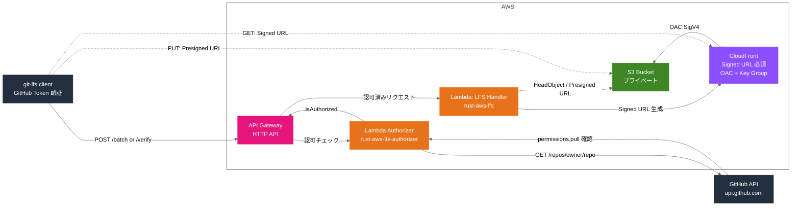
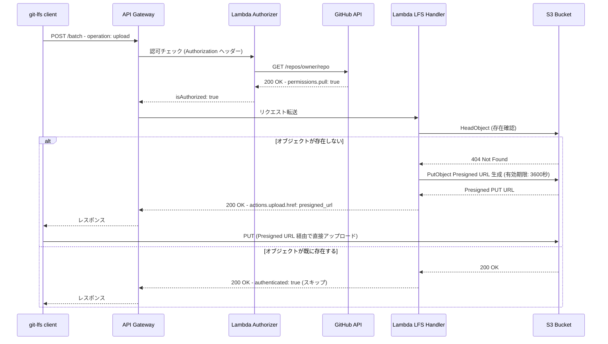
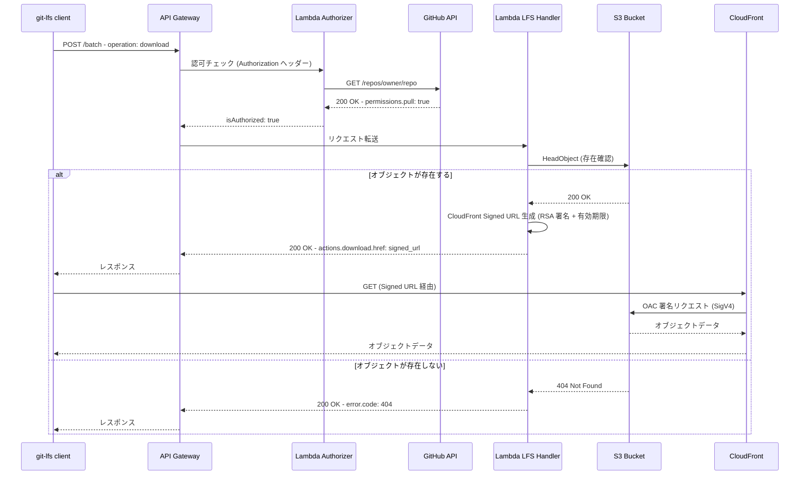
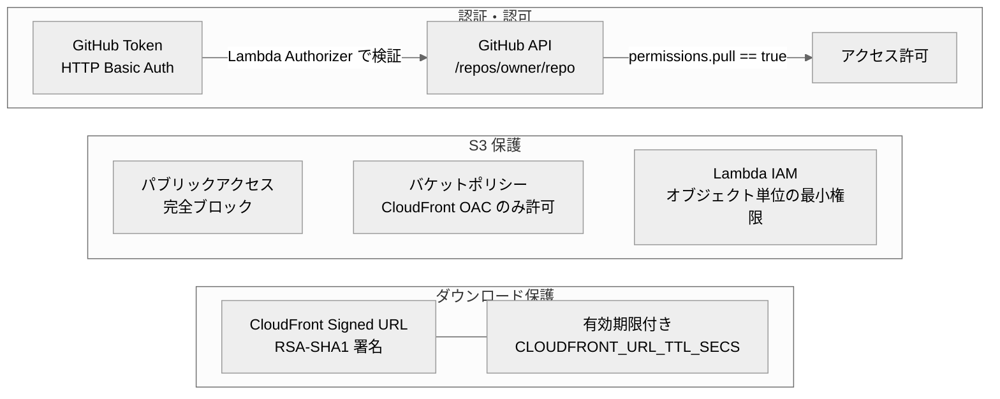

# AWS 構成図

## 全体構成

---

## アップロードフロー

---

## ダウンロードフロー

---

## AWS リソース一覧

| リソース | 名前/種別 | 役割 |
|---|---|---|
| API Gateway | HTTP API | LFS リクエストの受付・ルーティング |
| Lambda | rust-aws-lfs | LFS Batch/Verify API の処理、Presigned URL / Signed URL 生成 |
| Lambda | rust-aws-lfs-authorizer | GitHub API でトークン検証、リポジトリ read 権限確認 |
| S3 Bucket | (var.bucket_name) | LFS オブジェクト格納（プライベート、パブリックアクセス完全ブロック） |
| CloudFront | Distribution | S3 オブジェクトの CDN 配信（Signed URL 必須） |
| CloudFront OAC | Origin Access Control | S3 への署名付きアクセス制御（SigV4） |
| CloudFront Key Group | Public Key + Key Group | Signed URL の RSA 署名検証 |
| IAM Role | rust-aws-lfs-role | Lambda (LFS Handler) の実行ロール（S3 アクセス権限付き） |
| IAM Role | rust-aws-lfs-authorizer-role | Lambda Authorizer の実行ロール（基本実行権限のみ） |

---

## セキュリティ設計

